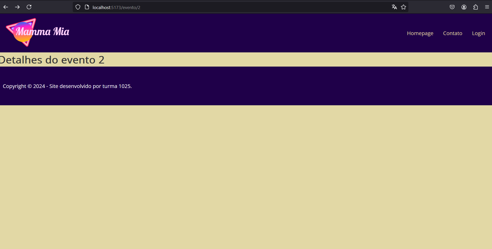

# Sistema de casa de eventos | React Vite Node Container Docker | Santander DevOps 1182



## Tecnologias Utilizadas

- React
- Vite
- Node v20.5.1
- Docker

## Dependências Utilizadas

- React Router
- Styled Components
- Axios
- React Toastify
- Json Server

## Participantes do projeto

- Aluno 01
- Aluno 02
- Aluno 03

## Responsaveis pelo desenvolvimento:

### Aluno 01

- Criou o componente de rotas
- Foi responsável pelo CSS

### Aluno 02

- Criou a página de login
- Criou o Componente de cabeçalho

## Instruções de Instalação

Clonar o projeto com o comando abaixo:

```sh
git clone https://github.com/Neto6391/container_ada_mod03.git
```

Entrar na pasta do projeto

```sh
cd container_ada_mod03
```

Instalar as dependencias

```sh
npm install
```
## Instruções de Instalação
Clonar o projeto com o comando abaixo:
```sh
git clone git@github.com:Neto6391/container_ada_mod03.git
```

Entrar no diretório do projeto:
```sh
cd container_ada_mod03
```

Instalar as dependencias
```sh
npm install
```
## Instruções para rodar o projeto

Digitar o comando para criar a imagem do docker baseado nos requisitos definidos do Dockerfile, necessita está no diretório raiz do projeto
```sh
docker buildx buld -t casa-de-eventos-react .
```
Digitar o comando para rodar a imagem do docker em uma porta especifica
```sh
docker run -d -p 3000:3000 -p 5173:5173 casa-de-eventos-react
```
 projeto já estará rodando no endereço
 ```sh
http://localhost:5173
```

Publicar no Docker Hub
```sh
docker push <tag do usuario do docker hub>/<tag do nome da imagem>:<tag da versão>
docker push vapeprosper/casa-de-eventos-react:v.1
```

## Agradecimentos
Codigos de React, Vite, Node e estruturação completa: https://github.com/roofranklin